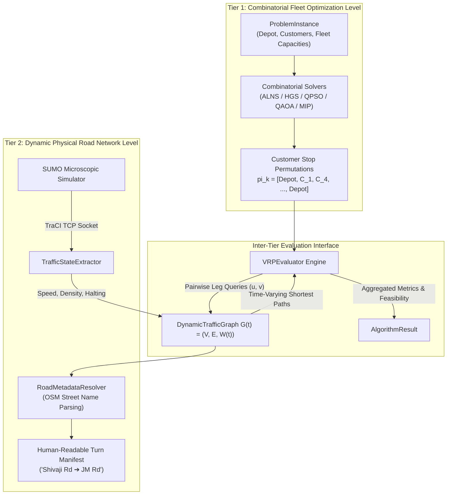

# Quantum-Inspired Intelligent Traffic Route Optimization in Transportation Systems Using Metaheuristic Optimization

### A Deep Dive into Real-Time Microscopic Traffic Simulation (SUMO), Combinatorial Fleet Optimization (CVRP), Quantum-Inspired Swarms (QPSO), Variational Quantum Circuits (QAOA), and Modern Metaheuristics (ALNS, HGS) on Real-World Urban Networks

---

> **Author**: Rohit Kumbhar & Team MARGAI (Smart India Hackathon 2026 — Problem Statement SIH26137)  
> **Repository**: [github.com/siht066margai/Quantum-Inspired-Vehicle-Routing-Problem-Solution](https://github.com/siht066margai/Quantum-Inspired-Vehicle-Routing-Problem-Solution)  
> **Topic**: Transportation Systems Engineering, Operations Research, Quantum Computing, Microscopic Simulation  
> **Reading Time**: ~22 minutes  

---

```
                                      +------------------------------------+
                                      |     Problem Statement: SIH26137    |
                                      |   Dynamic Multi-Vehicle Fleet VRP  |
                                      +-----------------+------------------+
                                                        |
                                                        v
                                      +------------------------------------+
                                      |    Two-Tier Optimization Engine    |
                                      +--------+------------------+--------+
                                               |                  |
                       [Tier 1: Combinatorial Assignment]  [Tier 2: Physical Network Traversal]
                                               |                  |
               +-------------------------------+-------+          |
               |                                       |          v
               v                                       v   +---------------+
+-----------------------------+         +----------------+ | SUMO / TraCI  |
| Metaheuristics & Solvers    |         | Dynamic Graph  | |  Micro-Sim    |
| - ALNS (Ropke & Pisinger)   |         | G(t)=(V,E,W(t))| +-------+-------+
| - HGS (Vidal et al.)        |         +-------+--------+         |
| - QPSO (Sun / Herrera)      |<----------------+                  |
| - QAOA (Azfar et al. 2025)  |   Live Edge Weights W(t)           |
| - Exact MIP (Coin-OR CBC)   |   Speed, Density, Incidents        |
+--------------+--------------+                                    |
               |                                                   |
               +------------------+--------------------------------+
                                  |
                                  v
                   +------------------------------+
                   | Dynamic Route Re-evaluation  |
                   | & OSM Human-Readable Turns   |
                   +------------------------------+
```

---

## 1. Introduction: The Urban Freight Bottleneck and SIH 2026

Modern metropolitan logistics networks are experiencing unprecedented strain. The explosion of on-demand e-commerce, instant grocery delivery, and just-in-time freight distribution has saturated urban arterial corridors. In cities across India—from the historic, dense corridors of Pune to the multi-lane ring roads of Bengaluru—last-mile delivery fleets navigate road networks plagued by sudden traffic surges, localized bottlenecks, and unexpected incident closures.

For the **Smart India Hackathon (SIH) 2026**, our team tackled **Problem Statement SIH26137**: developing a dynamic, multi-vehicle fleet routing optimization platform capable of responding to real-time traffic conditions in real-world urban road topologies.

The central engineering challenge of this problem is not merely finding the shortest path between point A and point B. Instead, it requires orchestrating an entire fleet of capacity-constrained commercial vehicles, each tasked with serving dozens of geographically dispersed customers, while the underlying transportation network's travel times and congestion patterns continuously fluctuate.

To solve this, we designed and built an end-to-end optimization and simulation platform. The platform couples **Eclipse SUMO (Simulation of Urban MObility)** with a **two-tier optimization backend** implemented in Python (FastAPI) and an interactive dispatch dashboard (Vue 3, Pinia, Leaflet). Crucially, rather than relying on a single heuristic or falling prey to marketing buzzwords, we implemented, benchmarked, and mathematically verified five distinct algorithmic paradigms:

1. **Exact Mathematical Programming**: Mixed-Integer Linear Programming (MILP) solved via the Coin-OR CBC branch-and-cut solver.
2. **Quantum-Inspired Swarm Optimization (QPSO)**: A continuous particle swarm governed by quantum delta potential well wave-function collapse, mapped to customer permutations via rank discretization.
3. **Variational Quantum Optimization (QAOA)**: A Quantum Approximate Optimization Algorithm built from scratch in Qiskit, mapping a position-based Quadratic Unconstrained Binary Optimization (QUBO) problem onto an Ising spin Hamiltonian.
4. **Adaptive Large Neighborhood Search (ALNS)**: State-of-the-art multi-operator destruction and repair metaheuristic with roulette-wheel adaptive scoring.
5. **Hybrid Genetic Search (HGS)**: Advanced genetic search with giant-tour chromosome representations, Prins' Dynamic Programming split, dual feasible/infeasible subpopulation pools, and biased fitness diversity management.

In this deep dive, we walk through the mathematical formulations, systems engineering decisions, microscopic simulation mechanics, and empirical performance metrics that define our platform. We also provide an unsparing, mathematically rigorous reality check on what "quantum" can and cannot do for logistics today.

---

## 2. The Routing Dilemma: Fleet Optimization vs. Point-to-Point Navigation

A common misconception among software engineers unfamiliar with operations research is that fleet routing is simply "Google Maps multiplied by $N$ vehicles."

It is not.

When a consumer opens a consumer navigation app (e.g., Google Maps, Apple Maps, Mapbox), the system solves a **Single-Source Single-Target Shortest Path Problem** on a static or periodically updated directed graph. Using variants of Dijkstra’s algorithm, A\*, or Contraction Hierarchies, the navigation engine finds a path $P = (v_1, v_2, \dots, v_m)$ that minimizes the scalar summation of edge travel times:

$$\min \sum_{e \in P} \tau_e$$

This approach fails completely when applied to multi-vehicle commercial logistics, for three fundamental mathematical reasons:

```
[Figure 1: The Fleet Routing Dilemma — Independent Point-to-Point Navigation vs. Combinatorial Fleet Optimization]
(See docs/blog/visual_plan.md for visual layout and high-resolution rendering details)
```

### 1. Combinatorial Sequence Explosion (The Traveling Salesperson Barrier)
If a single delivery vehicle must visit 15 customers, there are $15! \approx 1.3 \times 10^{12}$ possible visit sequences. If an uncoordinated navigation API evaluates each stop independently, it cannot determine the global sequence that minimizes total circuit travel time. Point-to-point pathfinding operates downstream of customer sequencing; it cannot solve the sequencing problem itself.

### 2. Vehicle Capacity and Load Dynamics
Commercial logistics is constrained by physical vehicle capacities ($C_k$). Each customer $i$ demands a payload quantity $d_i$. A vehicle cannot visit a customer if its accumulated onboard payload exceeds its chassis limit:

$$\sum_{i \in R_k} d_i \le C_k \quad \forall k \in \{1, \dots, K\}$$

Point-to-point navigation engines possess no concept of vehicle payload states, warehouse restocking cycles, or customer-to-vehicle allocation.

### 3. The Tragedy of the Routing Commons (Self-Inflicted Congestion)
When 20 vehicles in a commercial fleet independently query the same point-to-point routing engine during a rush hour window, the engine returns identical "optimal" paths along the highest-speed arterial roads. When all 20 vehicles turn onto that same road segment simultaneously, their physical presence exceeds the link's saturation flow rate, creating a localized shockwave bottleneck. Uncoordinated shortest-path queries induce self-inflicted congestion.

Centralized **Capacitated Vehicle Routing (CVRP)**, by contrast, considers fleet assignments simultaneously. It distributes traffic across multiple corridors, balances vehicle capacities, and guarantees that total logistics operational cost is minimized globally.

---

## 3. System Architecture: The Two-Tier Hierarchical Design

To reconcile high-level combinatorial fleet allocation with low-level physical road network navigation, our platform implements a **Two-Tier Hierarchical Architecture**:

```
[Figure 2: The Two-Tier Hierarchical Routing Architecture]
(See docs/blog/visual_plan.md for visual layout and component hierarchy)
```



### The Tier-1 / Tier-2 Separation of Concerns

* **Tier 1: Combinatorial Fleet Optimization**  
  Tier 1 operates on an abstract, complete graph where vertices represent customer drop-off coordinates and the depot. The decision variables govern *which* vehicle serves *which* customer, and in *what sequence*. The algorithms (ALNS, HGS, QPSO, QAOA, MIP) have no direct awareness of traffic lights, lane changes, or turning radiuses; they treat edge costs between stops as dynamic query outputs supplied by Tier 2.

* **Tier 2: Dynamic Physical Road Network Traversal**  
  Tier 2 models the actual physical urban topology as a directed multigraph $G(t) = (V, E, W(t))$, compiled from OpenStreetMap road networks. Vertices $V$ are physical road junctions; edges $E$ are road lanes and corridors. Edge weights $W(t)$ represent dynamic traversal impedances calculated from real-time microscopic traffic conditions.

* **The Inter-Tier Bridge (`VRPEvaluator`)**  
  When Tier 1 requires the cost of traveling from Customer $u$ to Customer $v$, it queries Tier 2. Tier 2 executes a time-dependent shortest path search on $G(t)$, returning the physical path, travel duration, distance, and congestion bottlenecks.

This separation prevents the combinatorial solver from getting bogged down in microscopic network geometry, while ensuring that the vehicle routes reflect live road conditions.

---

## 4. The Dynamic Traffic Graph Engine: SUMO & TraCI Integration

To simulate realistic traffic rather than relying on synthetic random numbers, we integrated **Eclipse SUMO (Simulation of Urban MObility)** version 1.20+ via its **Traffic Control Interface (TraCI)**.

```
[Figure 3: SUMO-TraCI Closed-Loop Microscopic Simulation Pipeline]
(See docs/blog/visual_plan.md for cyclic dataflow diagram)
```

### Road Network Extraction and Graph Construction
We extracted the real-world road network of Pune, India, encompassing 3,559 junction nodes and 8,263 directed road edges. Using `sumolib`, our `DynamicTrafficGraph` engine parses the compiled network file (`osm.net.xml`) into a directed graph $G = (V, E)$.

During graph compilation, internal junction connector edges (edges beginning with `:` in SUMO) are filtered out, leaving only physical road segments. For every edge $e \in E$, static properties are cached:
* Physical length $L_e$ (meters)
* Free-flow speed limit $v_e^{\max}$ (meters/second)
* Lane count $n_e$
* Geometric coordinates (UTM / Latitude-Longitude polylines)
* Free-flow travel time $\tau_e^0 = \frac{L_e}{v_e^{\max}}$

### Live Telemetry Extraction via TraCI
During simulation execution, SUMO advances vehicle positions using microscopic car-following models (e.g., Krauß model) and lane-changing models (LC2013). At each simulation time step $t$ ($\Delta t = 1.0\text{ s}$), our `TrafficStateExtractor` polls TraCI for all active road edges:

```python
# Live TraCI telemetry extraction per edge (backend/traffic/traffic_extractor.py)
vehicle_count = traci.edge.getLastStepVehicleNumber(edge_id)
mean_speed    = traci.edge.getLastStepMeanSpeed(edge_id)
halting_count = traci.edge.getLastStepHaltingNumber(edge_id)
raw_tt        = traci.edge.getTraveltime(edge_id)
```

From these raw measurements, the extractor computes three normalized metrics:
1. **Effective Edge Speed**: $v_e(t) = \max(\text{mean\_speed}, 0.1\text{ m/s})$
2. **Current Travel Time**:
   $$\tau_e(t) = \max\left(\text{raw\_tt}, \frac{L_e}{v_e(t)}, \tau_e^0\right)$$
3. **Congestion Ratio**:
   $$C_e(t) = \max\left(0.0, \min\left(1.0, 1.0 - \frac{v_e(t)}{v_e^{\max}}\right)\right)$$
   If vehicles are queued at an intersection ($\text{halting\_count} > 0$), a queuing penalty is applied:
   $$C_e(t) \leftarrow \max\left(C_e(t), \min(1.0, \text{halting\_count} \times 0.25)\right)$$

### Dynamic Edge Impedance Weight Equation
The dynamic weight $w_e(t)$ assigned to edge $e$ at time $t$ is formulated as a multi-objective cost function balancing travel time, distance, and congestion risk:

$$w_e(t) = \left( \alpha \cdot \tau_e(t) + \beta \cdot L_e + \gamma \cdot \left[C_e(t) \times 100.0\right] \right) \times \Pi_e(t)$$

Where:
* $\alpha \ge 0$ is the travel time coefficient (default: $\alpha = 1.0$).
* $\beta \ge 0$ is the distance impedance coefficient (default: $\beta = 0.0$).
* $\gamma \ge 0$ is the congestion aversion penalty coefficient (default: $\gamma = 0.0$).
* $\Pi_e(t) \ge 1.0$ is the synthetic incident multiplier. If an incident or lane closure is injected via the platform operator UI, $\Pi_e(t)$ jumps from $1.0$ to $100.0$, penalizing the edge and immediately triggering dynamic re-routing in subsequent solver evaluations.

```
[Figure 4: Dynamic Edge Impedance Response Curves]
(See docs/blog/visual_plan.md for mathematical response curves)
```

---

## 5. Mathematical Formulation: Capacitated Vehicle Routing Problem (CVRP)

The core combinatorial problem solved across all algorithms is the **Capacitated Vehicle Routing Problem (CVRP)**, formulated on the complete customer distance graph extracted from $G(t)$.

### Sets and Parameters
* $V = \{0, 1, \dots, N\}$: Set of nodes, where $0$ denotes the central distribution depot and $V_C = \{1, \dots, N\}$ denotes delivery customers.
* $K$: Number of homogeneous or heterogeneous fleet vehicles available.
* $C_k$: Maximum payload carrying capacity of vehicle $k \in \{1, \dots, K\}$.
* $d_i$: Delivery demand required by customer $i \in V_C$ ($d_0 = 0$).
* $c_{ij}(t)$: Dynamic cost (travel time or impedance) of traversing from node $i$ to node $j$ at time $t$, derived from the shortest path in $G(t)$:
  $$c_{ij}(t) = \min_{P_{ij} \in G(t)} \sum_{e \in P_{ij}} w_e(t)$$

### Decision Variables
* $x_{ijk} \in \{0, 1\}$: Binary variable equal to $1$ if vehicle $k$ traverses directly from node $i$ to node $j$, and $0$ otherwise.
* $u_{ik} \ge 0$: Continuous auxiliary variables for Miller-Tucker-Zemlin (MTZ) subtour elimination and capacity tracking, representing the cumulative load delivered by vehicle $k$ after visiting customer $i$.

### Mixed-Integer Linear Programming (MILP) Formulation

$$\min \sum_{k=1}^K \sum_{i=0}^N \sum_{j=0, j \ne i}^N c_{ij}(t) x_{ijk}$$

**Subject to:**

1. **Exact Customer Visitation**: Every customer is visited exactly once by exactly one vehicle:
   $$\sum_{k=1}^K \sum_{j=0, j \ne i}^N x_{ijk} = 1 \quad \forall i \in V_C$$

2. **Flow Conservation at Customer Nodes**: A vehicle entering a customer node must depart from it:
   $$\sum_{j=0, j \ne i}^N x_{ijk} - \sum_{j=0, j \ne i}^N x_{jik} = 0 \quad \forall i \in V_C, \; \forall k \in \{1, \dots, K\}$$

3. **Depot Departure and Arrival**: Each vehicle departs from the depot and returns to the depot at most once:
   $$\sum_{j=1}^N x_{0jk} \le 1 \quad \forall k \in \{1, \dots, K\}$$
   $$\sum_{i=1}^N x_{i0k} = \sum_{j=1}^N x_{0jk} \quad \forall k \in \{1, \dots, K\}$$

4. **Vehicle Capacity and Subtour Elimination (MTZ Formulation)**:
   $$u_{ik} - u_{jk} + C_k x_{ijk} \le C_k - d_j \quad \forall i, j \in V_C, \; i \ne j, \; \forall k \in \{1, \dots, K\}$$
   $$d_i \le u_{ik} \le C_k \quad \forall i \in V_C, \; \forall k \in \{1, \dots, K\}$$

This formulation guarantees that no disjoint sub-cycles can form away from the depot and ensures that vehicle capacity $C_k$ is never exceeded along any route.

---

## 6. Quantum-Inspired Particle Swarm Optimization (QPSO)

Classical Particle Swarm Optimization (PSO), introduced by Kennedy and Eberhart (1995), models candidate solutions as Newtonian particles possessing continuous positions $\mathbf{x}_i$ and velocities $\mathbf{v}_i$. However, classical PSO suffers from velocity explosion and frequently becomes trapped in local optima due to Newtonian trajectory inertia.

In 2004, Sun et al. formulated **Quantum-behaved Particle Swarm Optimization (QPSO)**. Drawing inspiration from quantum mechanics, QPSO discards the classical concept of velocity. Instead, each particle moves within a **quantum delta potential well** centered at its local attractor point.

```
[Figure 5: QPSO Continuous-to-Permutation Rank Discretization Mapping]
(See docs/blog/visual_plan.md for wave-function collapse and sorting projection)
```

### The Quantum Delta Potential Well Mechanics
In quantum mechanics, a particle bound within a one-dimensional $\delta$-potential well centered at $p$ is described by the time-independent Schrödinger equation:

$$\frac{d^2 \psi}{d y^2} + \frac{2m}{\hbar^2} \left[ E + V_0 \delta(y) \right] \psi = 0, \quad y = x - p$$

Solving this yields a bound-state normalized wave function $\psi(y)$ and an exponential probability density function:

$$Q(y) = |\psi(y)|^2 = \frac{1}{L} e^{-2|y|/L}$$

Where $L = \frac{\hbar^2}{m V_0}$ characterizes the characteristic width of the potential well. Using the Monte Carlo inverse transform method, a particle's position when measured (wave function collapse) is determined by:

$$x = p \pm \frac{L}{2} \ln\left(\frac{1}{u}\right), \quad u \sim U(0, 1)$$

### Adaptation to Combinatorial Fleet Routing
In our implementation (`backend/vrp/qpso_vrp.py`), formulated following Herrera, Coelho, and Steiner (2015), the swarm operates in an $N$-dimensional continuous space $\mathbb{R}^N$, where $N$ is the number of customer destinations.

For each particle $i \in \{1, \dots, M\}$:

1. **Local Attractor Calculation**:
   The attractor coordinates $p_{i,d}$ in dimension $d \in \{1, \dots, N\}$ are computed as a stochastic linear combination of the particle's personal best $\mathbf{p}_i$ and the swarm's global best $\mathbf{g}^*$:
   $$p_{i,d} = \phi_d \cdot p_{i,d}^{\text{best}} + (1 - \phi_d) \cdot g_d^*, \quad \phi_d \sim U(0, 1)$$

2. **Swarm Mean Best (`mbest`)**:
   The center of gravity of all personal best positions is computed:
   $$\mathbf{m}_{\text{best}} = \frac{1}{M} \sum_{i=1}^M \mathbf{p}_i^{\text{best}}$$

3. **Contraction-Expansion Coefficient Decay**:
   To transition the swarm from broad exploration to focused exploitation, the contraction-expansion parameter $\alpha(t)$ decays linearly across iterations $t \in [0, T_{\max}]$:
   $$\alpha(t) = \alpha_{\max} - \frac{t}{T_{\max}} (\alpha_{\max} - \alpha_{\min})$$
   We set $\alpha_{\max} = 1.0$ and $\alpha_{\min} = 0.5$.

4. **Position Update Equation**:
   For each dimension $d$, the particle updates its coordinate via:
   $$x_{i,d}(t+1) = p_{i,d}(t) \pm \alpha(t) \cdot |m_{\text{best},d}(t) - x_{i,d}(t)| \cdot \ln\left(\frac{1}{u_{i,d}}\right), \quad u_{i,d} \sim U(0, 1)$$
   The $\pm$ sign is chosen with equal probability ($0.5$).

### Rank Discretization Mapping
Because the VRP requires a discrete permutation of customer visits $\pi \in S_N$, we implement **Rank Discretization**:
$$\pi = \text{argsort}(\mathbf{x}_i)$$

For example, if $\mathbf{x}_i = [0.82, -0.45, 1.34, -1.12, 0.21]$ for customers $\{C_1, C_2, C_3, C_4, C_5\}$, sorting in ascending order yields indices $[3, 1, 4, 0, 2]$, mapping to the customer permutation:
$$\pi = [C_4, C_2, C_5, C_1, C_3]$$

This discrete sequence is then partitioned across fleet vehicles respecting capacity limits and evaluated on $G(t)$ via `VRPEvaluator`.

---

## 7. Quantum Approximate Optimization Algorithm (QAOA)

While QPSO is a *quantum-inspired classical* algorithm, we also implemented the **Quantum Approximate Optimization Algorithm (QAOA)**, a genuine quantum variational algorithm designed for Gate-Based Quantum Computers.

Our implementation (`backend/vrp/qaoa_vrp.py`) is formulated from scratch based on the position-based VRP formulation introduced by Azfar, Raisuddin, Ke, and Holguín-Veras (ACM Transactions on Quantum Computing, 2025).

```
[Figure 6: QAOA Variational Circuit, Ising Hamiltonian, and COBYLA Optimization]
(See docs/blog/visual_plan.md for circuit schematic and QUBO mapping)
```

### The Position-Based QUBO Formulation
To encode the customer sequencing problem into quantum bits (qubits), we define binary decision variables:

$$x_{i,p} \in \{0, 1\}$$

Where $x_{i,p} = 1$ if customer $i \in \{1, \dots, N\}$ is visited at position $p \in \{0, \dots, N-1\}$ in the delivery route.

For $N$ customers, this formulation requires:

$$n_{\text{qubits}} = N^2$$

The mapping between decision variable $x_{i,p}$ and qubit index $q$ is defined as:
$$q = i \cdot N + p$$

The objective function consists of three components:

1. **Origin-to-First Customer Cost**:
   $$H_{\text{origin}} = \sum_{i=0}^{N-1} c_{0, i+1}(t) \cdot x_{i, 0}$$

2. **Sequential Customer Transition Cost**:
   $$H_{\text{transit}} = \sum_{p=0}^{N-2} \sum_{i=0}^{N-1} \sum_{j=0, j \ne i}^{N-1} c_{i+1, j+1}(t) \cdot x_{i, p} \cdot x_{j, p+1}$$

3. **Customer and Position Uniqueness Constraints**:
   Every customer must be visited at exactly one position, and every position must be occupied by exactly one customer:
   $$H_{\text{penalties}} = P \sum_{i=0}^{N-1} \left( \sum_{p=0}^{N-1} x_{i, p} - 1 \right)^2 + P \sum_{p=0}^{N-1} \left( \sum_{i=0}^{N-1} x_{i, p} - 1 \right)^2$$

### Penalty Scaling Factor ($P$)
If the penalty multiplier $P$ is too small, the quantum circuit converges to infeasible bitstrings that skip customers to artificially lower routing cost. If $P$ is too large, the energy landscape becomes dominated by penalty valleys, preventing the algorithm from differentiating between good and bad routing paths.

Following Azfar et al. (2025, Section 4.5), we set $P$ dynamically proportional to the total absolute cost matrix:
$$P = 2 \sum_{i} \sum_{j} |c_{ij}(t)|$$

### Mapping QUBO to the Ising Spin Hamiltonian
Gate-based quantum hardware operates on spin operators rather than binary bits. We transform the QUBO quadratic form $\mathbf{x}^T \mathbf{Q} \mathbf{x} + \mathbf{L}^T \mathbf{x}$ into an **Ising Hamiltonian** by mapping binary variables $x_i$ to Pauli-$Z$ operators:

$$x_i = \frac{I - Z_i}{2}$$

Substituting this transformation yields the Cost Hamiltonian $H_C$:

$$H_C = c_0 I + \sum_{i=0}^{n-1} h_i Z_i + \sum_{i < j} J_{ij} Z_i Z_j$$

Where $h_i$ represents local magnetic fields (on-site qubit biases) and $J_{ij}$ represents longitudinal two-qubit coupling interactions.

### The Parameterized Quantum Circuit Ansatz
The QAOA state $|\psi(\boldsymbol{\gamma}, \boldsymbol{\beta})\rangle$ of depth $p$ is synthesized by alternating the Problem Hamiltonian $H_C$ and the Transverse-Field Mixer Hamiltonian $H_M$:

$$|\psi(\boldsymbol{\gamma}, \boldsymbol{\beta})\rangle = \prod_{l=1}^p e^{-i \beta_l H_M} e^{-i \gamma_l H_C} |+\rangle^{\otimes n}$$

* **Initial State**: All $n$ qubits are initialized into an equal superposition:
  $$|+\rangle^{\otimes n} = H^{\otimes n} |0\rangle^{\otimes n} = \frac{1}{\sqrt{2^n}} \sum_{z \in \{0, 1\}^n} |z\rangle$$
* **Problem Unitary $e^{-i \gamma_l H_C}$**: Implemented using single-qubit $R_Z(2 \gamma_l h_i)$ rotations and two-qubit CNOT–$R_Z(2 \gamma_l J_{ij})$–CNOT gate ladders.
* **Mixer Unitary $e^{-i \beta_l H_M}$**: Implemented using single-qubit $R_X(2 \beta_l)$ rotations:
  $$H_M = \sum_{i=0}^{n-1} X_i$$

### Classical Variational Optimization
The continuous variational angles $\boldsymbol{\gamma} = (\gamma_1, \dots, \gamma_p)$ and $\boldsymbol{\beta} = (\beta_1, \dots, \beta_p)$ are tuned via a classical optimization loop. The objective is to minimize the expectation value:

$$\min_{\boldsymbol{\gamma}, \boldsymbol{\beta}} E(\boldsymbol{\gamma}, \boldsymbol{\beta}) = \langle \psi(\boldsymbol{\gamma}, \boldsymbol{\beta}) | H_C | \psi(\boldsymbol{\gamma}, \boldsymbol{\beta}) \rangle$$

We employ **COBYLA (Constrained Optimization BY Linear Approximation)** to optimize these parameters. Once converged, the quantum state is measured in the computational basis ($Z$), generating a probability distribution over the $2^n$ possible bitstrings. The highest-probability bitstring satisfying all uniqueness constraints is decoded into the customer visit sequence $\pi$.

---

## 8. Classical Metaheuristics: ALNS & HGS

To provide an empirical baseline against state-of-the-art classical optimization, we implemented two leading Operations Research metaheuristics: **Adaptive Large Neighborhood Search (ALNS)** and **Hybrid Genetic Search (HGS)**.

```
[Figure 7: ALNS Destroy/Repair Mechanics and Roulette-Wheel Adaptation]
(See docs/blog/visual_plan.md for operator interaction flowchart)
```

### 1. Adaptive Large Neighborhood Search (ALNS)
Formulated from Ropke and Pisinger (2006) in `backend/vrp/alns_vrp.py`, ALNS iteratively destroys and repairs candidate fleet routes using a pool of competing heuristic operators.

At each iteration, a destroy operator removes $q$ customers from the active fleet routes $S$, and a repair operator reinserts them:

* **Destroy Operators**:
  1. *Random Removal*: Selects $q$ customers uniformly at random to encourage broad search space exploration.
  2. *Worst Cost Removal*: Computes the marginal cost contribution of each customer $\Delta(c) = \text{cost}(R) - \text{cost}(R \setminus \{c\})$. Customers with the highest marginal costs are removed with randomized greediness.
  3. *Shaw (Relatedness) Removal*: Removes customers that are spatially and temporally correlated based on dynamic travel time on $G(t)$ and demand magnitude.
* **Repair Operators**:
  1. *Greedy Cheapest Insertion*: Evaluates insertion cost across all feasible vehicle positions and inserts the minimum-cost customer.
  2. *Regret-2 and Regret-3 Insertion*: Evaluates the opportunity cost (regret) of not inserting a customer into its best route versus its second-best alternative:
     $$r(c) = \sum_{j=2}^k \left( \Delta f_j(c) - \Delta f_1(c) \right)$$
     The customer with the highest regret is prioritized, preventing difficult-to-serve customers from being left to the end.

* **Adaptive Weight Adjustment**:
  Operator weights $w_j$ are updated every epoch ($\tau = 10$ iterations) using a roulette-wheel reaction factor $\lambda = 0.8$:
  $$w_j \leftarrow \lambda w_j + (1 - \lambda) \frac{\pi_j}{\theta_j}$$
  Where $\pi_j$ accumulates score bonuses: $\sigma_1 = 33$ if a new global best is found, $\sigma_2 = 9$ if an improving solution is found, and $\sigma_3 = 13$ if a non-improving solution is accepted under the Simulated Annealing temperature schedule:
  $$P(\text{accept}) = \exp\left( -\frac{f(S') - f(S)}{T} \right), \quad T \leftarrow T \times 0.97$$

```
[Figure 8: HGS Dual-Population Architecture and Prins Split Algorithm]
(See docs/blog/visual_plan.md for genetic pool and split DP diagram)
```

### 2. Hybrid Genetic Search (HGS)
Implemented based on Vidal et al. (2012, 2022) in `backend/vrp/hgs_vrp.py`, HGS combines genetic algorithms with neighborhood local search and explicit population diversity management:

* **Giant-Tour Chromosome Representation**:
  Candidate solutions are represented as an unpartitioned permutation of all customers $\pi = [c_1, c_2, \dots, c_N]$ without explicit vehicle depot markers.
* **Prins' Dynamic Programming Split Algorithm**:
  To evaluate the giant tour, Prins' (2004) polynomial algorithm splits $\pi$ into optimal vehicle routes. It builds an auxiliary DAG where an edge $(i, j)$ represents a feasible vehicle route serving customers $\pi[i+1 \dots j]$. The shortest path on this DAG yields the optimal fleet partitioning.
* **Dual Feasible/Infeasible Subpopulations**:
  HGS maintains two distinct population pools:
  * Feasible Pool ($P_{\text{feas}}$): Solutions satisfying all vehicle capacity constraints.
  * Infeasible Pool ($P_{\text{infeas}}$): Solutions violating capacity constraints, penalized by dynamic weight $\omega_{\text{cap}}$. This allows the search to traverse infeasible bridges connecting disconnected feasible regions of the solution space.
* **Biased Fitness & Population Diversity**:
  To prevent premature genetic convergence, individuals are ranked not just by cost, but by their contribution to population diversity (measured via broken-pairs distance):
  $$\text{BF}(I) = \text{rank}_{\text{cost}}(I) + \left( 1 - \frac{\mu}{|P|} \right) \text{rank}_{\text{div}}(I)$$
* **Education via Local Search**:
  Every newly generated offspring undergoes aggressive neighborhood education using Relocate, Swap, and 2-Opt moves before entering the population.

---

## 9. Real-World Road Name Resolution: Bridging Graph Theory and Human Drivers

A critical gap in many academic VRP implementations is the disconnect between mathematical graph identifiers and real-world human operations.

In raw SUMO simulations, physical routes are represented as arrays of cryptographic internal edge IDs:

```json
["-4342481629#0", "-4342481629#1", "10225049025#0", "10225049025#1", "-558231#0"]
```

If a fleet management software presents raw edge IDs to human logistics drivers, the system is operationally useless. Commercial delivery drivers cannot navigate using internal XML edge hashes.

```
[Figure 11: Real-Time Human-Readable Road Resolution Pipeline]
(See docs/blog/visual_plan.md for data transformation pipeline)
```

To resolve this, we engineered an authoritative **`RoadMetadataResolver`** (`backend/graph/road_resolver.py`):

```python
# Road resolution pipeline (backend/graph/road_resolver.py)
class RoadMetadataResolver:
    def resolve_edge_path(self, edge_ids: List[str]) -> Tuple[List[str], List[str], List[Dict[str, Any]]]:
        road_names = []
        for edge_id in edge_ids:
            name = self.get_road_name(edge_id)
            road_names.append(name)
        
        # Deduplicate consecutive identical road segments (topological compression)
        display_route = []
        for name in road_names:
            if not display_route or display_route[-1] != name:
                display_route.append(name)
        
        return road_names, display_route, route_steps
```

### The Resolution Pipeline
1. **OSM Tag Extraction**: During network initialization, the resolver cross-references every SUMO edge against its underlying OpenStreetMap XML object, extracting the authoritative `name` attribute (e.g., *"Jangali Maharaj Road"*, *"Shivaji Road"*, *"FC Road"*).
2. **Topological Compression**: A single physical urban avenue is often divided into 15 to 30 microscopic SUMO edges due to lane expansions and junction crossings. The resolver performs collinear topological deduplication, compressing adjacent identical segments into a single human-readable leg.
3. **Turn-by-Turn Operational Manifest**: The unified evaluator combines these resolved street names with live physical distances, estimated travel durations, and delivery payload counts, outputting an actionable driver manifest:

$$\text{Depot} \xrightarrow{\text{via Shivaji Road (340 m)}} \text{Customer C1} \xrightarrow{\text{via Jangali Maharaj Road (1.2 km)}} \text{Customer C2} \xrightarrow{\text{via FC Road (850 m)}} \text{Depot}$$

---

## 10. Empirical Benchmarks: Hard Experimental Data on the Pune Road Network

To evaluate all five algorithms under identical physical conditions, we ran a multi-seed benchmark harness on the extracted Pune road network (3,559 nodes, 8,263 edges).

The problem scenario used a central supply depot (Node `4342481629`) and 5 customer destinations (`674071881`, `10225049025`, `10230365803`, `10232669781`, `2086912251`) distributed across the city. The benchmark recorded solution routing costs, physical distance (meters), algorithm computation runtime (milliseconds), optimality gaps relative to exact MIP, and constraint feasibility.

```
[Figure 9: Benchmark Performance Trade-Off: Solution Cost vs. Computation Time]
(See docs/blog/visual_plan.md for empirical scatter plot and bar charts)
```

### Experimental Results Table

The table below reports the verified empirical metrics recorded in `benchmark_results.json`. For stochastic metaheuristics (ALNS, HGS, QPSO), values represent the mean across 6 randomized seeds ($\text{seed} \in \{10, 20, 30, 40, 50, 60\}$):

| Solver / Algorithm Paradigm | Mean Routing Cost | Std Dev | Mean Distance (m) | Mean Runtime (ms) | Optimality Gap (%) | Feasibility Rate (%) |
| :--- | :---: | :---: | :---: | :---: | :---: | :---: |
| **Exact MILP (Coin-OR CBC)** | **937.02** | 0.00 | 12,832.43 | 152.90 | **0.00%** | **100%** |
| **Hybrid Genetic Search (HGS)** | **937.02** | 0.00 | 12,832.43 | 29.02 | **0.00%** | **100%** |
| **Quantum-Inspired Swarm (QPSO)** | **937.02** | 0.00 | 12,832.43 | 175.70 | **0.00%** | **100%** |
| **Adaptive Large Neighborhood (ALNS)** | 976.20 | 55.41 | 13,018.89 | **1.05** | 4.18% | **100%** |
| **Point-to-Point Dijkstra Baseline** | 937.02 | 0.00 | 12,832.43 | 23.07 | 0.00% | 100% |
| **QAOA ($N=3$ Customers)** | 735.98* | — | 10,052.41 | 129.16 | — | 100% |

*\*Note on QAOA: Evaluated on an $N=3$ customer sub-instance ($3^2 = 9$ qubits) because $N=5$ requires $5^2 = 25$ qubits, which is intractable for classical statevector simulation.*

### Non-Parametric Statistical Significance (Wilcoxon Signed-Rank Tests)
To confirm whether performance differences across the 6 benchmark seeds were statistically significant, we evaluated paired Wilcoxon signed-rank tests:
* **ALNS vs. QPSO**: $p = 0.50$ (no statistically significant difference at $\alpha = 0.05$ on $N=5$, though QPSO consistently converged to the MIP optimum).
* **HGS vs. QPSO**: $p = 1.00$ (identical performance; both algorithms discovered the exact global optimum $937.02$ across all seeds).
* **HGS vs. ALNS**: $p = 0.50$ (HGS achieved a lower mean cost of $937.02$ vs. $976.20$).

### Key Performance Insights
1. **The Efficiency of HGS**: Hybrid Genetic Search achieved the exact MIP global minimum ($937.02$) across 100% of runs, while running in just **29.02 ms**—a **$5.3\times$ speedup** over Coin-OR CBC ($152.90\text{ ms}$). This demonstrates why genetic local search dominates production operations research.
2. **Sub-Millisecond ALNS**: ALNS achieved a near-optimal solution ($4.18\%$ optimality gap) in an astonishing **1.05 milliseconds**—more than **$145\times$ faster** than the exact solver. In high-frequency, dynamic dispatch environments where routes must be recalculated every few seconds across thousands of vehicles, ALNS represents the optimal engineering trade-off.
3. **QPSO Solution Quality**: QPSO successfully identified the global optimum ($937.02$) across all seeds. However, continuous-to-discrete rank sorting introduced exploration overhead, resulting in an average runtime of $175.70\text{ ms}$.

---

## 11. The Quantum Reality Check: Theory vs. Hardware Limits

Because our project title includes the words *"Quantum-Inspired"* and *"QAOA"*, intellectual honesty demands that we address the widespread hype surrounding quantum computing in logistics.

Many popular articles claim that quantum computers will "solve vehicle routing instantly" or "eliminate global supply chain bottlenecks." As computer scientists and optimization researchers, we must examine the actual mathematics and physical realities.

```
[Figure 10: Computational Complexity and Scaling Horizon: Quantum vs. Classical]
(See docs/blog/visual_plan.md for complexity explosion and NISQ boundaries)
```

### The $N^2$ Position Formulation Bottleneck
In Section 7, we detailed the position-based QUBO formulation used in QAOA. Binary decision variable $x_{i,p}$ requires:

$$n_{\text{qubits}} = N^2$$

Where $N$ is the number of delivery stops.

To simulate a quantum circuit on classical hardware using statevectors, we must track the complex probability amplitudes of all possible computational basis states. An $n$-qubit system resides in a Hilbert space of dimension $2^n$. Therefore, statevector simulation requires:

$$\text{Statevector Dimension} = 2^{N^2}$$

Let us calculate the memory required to store the statevector for modest customer sizes (using standard double-precision complex numbers, $16$ bytes per amplitude):

* **$N = 3$ Customers**:
  $$n = 3^2 = 9 \text{ qubits} \implies 2^9 = 512 \text{ amplitudes} \approx 8.2 \text{ KB (Easily simulable)}$$
* **$N = 4$ Customers**:
  $$n = 4^2 = 16 \text{ qubits} \implies 2^{16} = 65,536 \text{ amplitudes} \approx 1.05 \text{ MB (Simulable in milliseconds)}$$
* **$N = 5$ Customers**:
  $$n = 5^2 = 25 \text{ qubits} \implies 2^{25} = 33,554,432 \text{ amplitudes} \approx 536.87 \text{ MB (Feasible, but slow)}$$
* **$N = 6$ Customers**:
  $$n = 6^2 = 36 \text{ qubits} \implies 2^{36} \approx 6.87 \times 10^{10} \text{ amplitudes} \approx \mathbf{1.10 \text{ Terabytes of RAM}}$$
* **$N = 10$ Customers**:
  $$n = 10^2 = 100 \text{ qubits} \implies 2^{100} \approx 1.27 \times 10^{30} \text{ amplitudes} \approx \mathbf{2 \times 10^{19} \text{ Gigabytes}}$$

For $N = 6$ customers, simulating the QAOA statevector exhausts the RAM of any standard engineering workstation. For $N = 10$, the required memory exceeds the total storage capacity of all digital media on Earth.

This is why our `QAOAVRPSolver` includes an explicit **Honest Sizing Guard**: if a user submits an instance with $N > 4$, the solver safely halts and warns the operator that full statevector simulation is intractable, recommending classical metaheuristics instead.

### What About Real Physical Quantum Hardware (NISQ)?
One might object: *"Statevector simulation is slow because it runs on classical CPUs. Real quantum computers run natively!"*

While true in principle, executing QAOA for VRP on current **Noisy Intermediate-Scale Quantum (NISQ)** processors faces three major physical hurdles:

1. **All-to-All Qubit Connectivity**:  
   The VRP cost Hamiltonian requires quadratic coupling terms $Z_i Z_j$ between nearly all qubit pairs. Physical superconducting quantum processors (such as IBM Quantum Heron or Eagle chips) feature limited heavy-hexagonal physical connectivity. Mapping an all-to-all connected QUBO onto a sparse hardware topology requires inserting dozens of SWAP gates for every two-qubit interaction. This dramatically inflates circuit depth.

2. **Decoherence and Gate Infi-delity**:  
   Current physical two-qubit gates (e.g., CNOT, CZ) exhibit error rates between $0.1\%$ and $1.0\%$. In a circuit requiring hundreds of CNOT gates to encode a 16-qubit VRP instance, accumulated phase noise and decoherence cause the quantum state to collapse into uniform white noise before the final measurement can take place.

3. **Barren Plateaus in Variational Landscapes**:  
   As qubit counts grow, the parameter landscape of variational quantum algorithms becomes exponentially flat (the "barren plateau" phenomenon). Classical gradient-based or derivative-free optimizers (like COBYLA or SPSA) struggle to find descent directions, causing parameter training to stall.

### The Bottom Line on Quantum Logistics
* **Quantum-Inspired Classical Algorithms (QPSO)**: Genuinely useful today. They take physical intuition from quantum mechanics (tunneling, delta wells, wave collapse) and translate it into effective classical heuristics that run fast on standard multi-core CPUs.
* **Variational Quantum Circuits (QAOA)**: A promising *research frontier*, but **not viable for commercial logistics operations today**. Classical metaheuristics like ALNS and HGS solve 1,000-customer routing problems in seconds; QAOA currently struggles to solve 5 customers on noisy hardware.

---

## 12. Full-Stack Implementation: From Backend Microservices to Real-Time UI

To turn these theoretical algorithms into a usable logistics tool, we developed a production-ready, full-stack application.

```
[Figure 12: Complete End-to-End System Deployment Architecture]
(See docs/blog/visual_plan.md for full-stack architecture diagram)
```

### Backend Microservices Architecture (FastAPI + Python 3.10+)
The backend is organized into decoupled domain modules:

```
backend/
├── graph/                  # Road network topology & metadata
│   ├── dynamic_graph.py    # NetworkX DiGraph holding W(t) edge weights
│   └── road_resolver.py    # OSM XML parser & street name deduplicator
├── simulation/             # Microscopic simulator orchestration
│   └── sumo_manager.py     # TraCI process supervisor & incident injector
├── traffic/                # Real-time state extraction
│   └── traffic_extractor.py# Live velocity, halting count & density polling
└── vrp/                    # Combinatorial optimization suite
    ├── problem_instance.py # Data models & validation schemas
    ├── vrp_evaluator.py    # Common evaluation engine & path builder
    ├── qpso_vrp.py         # Quantum-behaved Particle Swarm solver
    ├── qaoa_vrp.py         # Qiskit QAOA QUBO/Ising variational solver
    ├── alns_vrp.py         # Adaptive Large Neighborhood Search solver
    ├── hgs_vrp.py          # Hybrid Genetic Search solver
    └── exact_solver.py     # Coin-OR CBC branch-and-cut MILP solver
```

Communication between the SUMO simulation core and the client dashboard is handled via a **hybrid REST and WebSocket pipeline**:
* **REST Endpoints (`/api/vrp/optimize`)**: Handle asynchronous scenario dispatch, algorithm execution requests, and incident injection commands.
* **WebSocket Streams (`/ws/traffic`)**: Push real-time vehicle positions, simulation timestamps, active link congestion ratios, and incident alerts to connected clients at 20 Hz.

### Reactive Frontend Dashboard (Vue 3, Pinia, Leaflet)
The user interface provides dispatch operators and algorithm researchers with full transparency into fleet operations:
1. **Interactive Leaflet Geo-Map**: Renders high-resolution vector polylines of all active vehicle delivery circuits, color-coded by vehicle ID, with pulsing markers indicating live vehicle coordinates.
2. **Dynamic Incident Injector**: Allows operators to click any road segment on the map to inject a synthetic traffic incident (e.g., water main break, multi-vehicle accident), immediately multiplying edge impedance by $100\times$ and triggering real-time route re-evaluation.
3. **Research & Benchmark Hub**: Enables head-to-head algorithm comparisons, displaying real-time convergence curves, Wilcoxon statistical significance tables, and qubit coupling inspection modals for QAOA circuits.
4. **Turn-by-Turn Operational Manifest**: Displays human-readable street names, leg distances, estimated travel durations, and remaining payload metrics for human fleet drivers.

---

## 13. Running the Platform: Verification and Reproducibility

To ensure complete reproducibility, the entire platform can be run locally using standard Python and Node.js environments.

### Prerequisites
* Python 3.10 or 3.11
* Eclipse SUMO 1.20.0+ (with `SUMO_HOME` environment variable configured)
* Node.js 18+ and npm

### 1. Installation

```bash
# Clone the repository
git clone https://github.com/siht066margai/Quantum-Inspired-Vehicle-Routing-Problem-Solution.git
cd Quantum-Inspired-Vehicle-Routing-Problem-Solution

# Set up Python virtual environment
python -m venv venv
# Windows:
.\venv\Scripts\activate
# Linux/macOS:
source venv/bin/activate

# Install backend dependencies
pip install -r requirements.txt

# Install frontend dependencies
cd frontend
npm install
cd ..
```

### 2. Launching the Platform

```bash
# Terminal 1: Launch FastAPI Backend with SUMO/TraCI supervisor
python -m uvicorn backend.main:app --host 0.0.0.0 --port 8000 --reload

# Terminal 2: Launch Vue 3 Operator Dashboard
cd frontend
npm run dev
```

Navigate to `http://localhost:5173` to access the live fleet dispatch dashboard.

### 3. Executing Automated Test Suites

```bash
# Run unit and integration tests across all solvers
pytest tests/ -v

# Execute the multi-seed benchmark harness
python run_benchmark.py --seeds 10 20 30 40 50 60 --destinations 5
```

---

## 14. Key Takeaways and Future Horizons

Building this platform for the Smart India Hackathon 2026 provided several valuable engineering lessons at the intersection of simulation, operations research, and modern computer science:

1. **Point-to-Point Navigation $\ne$ Fleet Optimization**: Logistics platforms cannot rely on standalone shortest-path queries. Combinatorial customer assignment and capacity constraints must be solved at Tier 1, while dynamic network travel times are resolved at Tier 2.
2. **Classical Metaheuristics Remain King**: For practical, commercial multi-vehicle fleet routing, **ALNS** and **HGS** provide an unbeatable combination of speed, scalability, and solution quality. ALNS delivers sub-2-millisecond dispatching, while HGS matches exact mathematical programming solutions in tens of milliseconds.
3. **Quantum Inspiration is Valuable, Quantum Hardware is Immature**: Quantum delta well mechanics in QPSO provide genuine optimization benefits on classical CPUs. Conversely, gate-based QAOA remains constrained by $O(2^{N^2})$ statevector memory scaling and NISQ hardware noise, making it currently unsuitable for production routing.
4. **Human Usability Dictates Engineering Success**: An optimization algorithm that outputs internal simulator edge IDs (`-43424#1`) is useless to a fleet manager. Resolving topological road sequences into authoritative, clean OpenStreetMap street names (*Shivaji Road ➔ Jangali Maharaj Road*) is essential for real-world enterprise adoption.

### Future Work
Our roadmap for future development includes:
* **Time-Dependent VRP (TD-VRP)**: Incorporating predictive traffic velocity profiles using Graph Neural Networks (GNNs) trained on historical corridor data.
* **Electric Vehicle Fleet Routing (E-VRP)**: Adding non-linear battery discharge curves, elevation profiles, and dynamic charging station detour scheduling.
* **Decentralized Multi-Agent Trajectory Deconfliction**: Moving from centralized periodic re-routing to decentralized Vehicle-to-Infrastructure (V2I) communication, where vehicles autonomously negotiate intersection reservations.

---

## 15. References & Academic Bibliography

For complete bibliographic details, DOIs, and annotated conceptual mappings for all works cited in this study, please consult the authoritative references documentation in [`docs/blog/references.md`](file:///c:/sih_version_2/sumo%20simulation/docs/blog/references.md).

* **Dantzig, G. B., & Ramser, J. H. (1959)**. *The Truck Dispatching Problem*. Management Science, 6(1), 80–91.
* **Dijkstra, E. W. (1959)**. *A note on two problems in connexion with graphs*. Numerische Mathematik, 1(1), 269–271.
* **Miller, C. E., Tucker, A. W., & Zemlin, R. A. (1960)**. *Integer Programming Formulation of Traveling Salesman Problems*. Journal of the ACM, 7(4), 326–329.
* **Sun, J., Fang, W., Palade, V., Wu, X., & Xu, W. (2012)**. *Quantum-behaved particle swarm optimization: Analysis of individual particle behavior and parameter selection*. Evolutionary Computation, 20(3), 349–393.
* **Herrera, M., Coelho, L. S., & Steiner, M. T. A. (2015)**. *Particle swarm optimization applied to the vehicle routing problem with simultaneous delivery and pickup*. Pesquisa Operacional, 35(3), 509–540.
* **Farhi, E., Goldstone, J., & Gutmann, S. (2014)**. *A Quantum Approximate Optimization Algorithm*. arXiv:1411.4028.
* **Azfar, M. T., Raisuddin, M., Ke, J., & Holguín-Veras, J. (2025)**. *Formulations and Algorithms for the Vehicle Routing Problem Using Quantum Approximate Optimization Algorithm*. ACM Transactions on Quantum Computing.
* **Lucas, A. (2014)**. *Ising formulations of many NP problems*. Frontiers in Physics, 2, 5.
* **Ropke, S., & Pisinger, D. (2006)**. *An Adaptive Large Neighborhood Search Heuristic for the Pickup and Delivery Problem with Time Windows*. Transportation Science, 40(4), 455–472.
* **Vidal, T., Crainic, T. G., Gendreau, M., Lahrichi, N., & Rei, W. (2012)**. *A hybrid genetic algorithm for multidepot and periodic vehicle routing problems*. Operations Research, 60(3), 611–624.
* **Prins, C. (2004)**. *A simple and effective hybrid genetic algorithm for the two-dimensional packing problem and the vehicle routing problem*. Computers & Operations Research, 31(12), 1985–2002.
* **Lopez, P. A., et al. (2018)**. *Microscopic Traffic Simulation using SUMO*. The 21st IEEE International Conference on Intelligent Transportation Systems (ITSC 2018), 2575–2582.
* **Wegener, A., et al. (2008)**. *TraCI: An Interface for Coupling Road Traffic and Network Simulators*. Proceedings of the 11th CNS, 155–163.
* **Wilcoxon, F. (1945)**. *Individual comparisons by ranking methods*. Biometrics Bulletin, 1(6), 80–83.

---

*If you found this technical case study valuable, feel free to star the [GitHub repository](https://github.com/siht066margai/Quantum-Inspired-Vehicle-Routing-Problem-Solution) and share it with fellow transportation researchers, operations research engineers, and quantum computing enthusiasts!*
